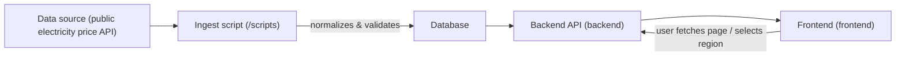

# Nordic-Energy-Dashboard

A small, holistic project: fetches hourly electricity prices from a public source, stores them locally, and exposes them via an API which the frontend displays in a simple dashboard.

## Directory Structure

```
/                     # Repository root (README, license, CI, etc.)
├─ backend/           # API, data models, and database access
│  ├─ api/            # FastAPI routers/endpoints (e.g. /prices)
│  ├─ models.py       # ORM models (tables/entities)
│  ├─ crud.py         # Read/write DB (Create/Read/Update/Delete)
│  ├─ db.py           # DB connection, session handling
│  └─ main.py         # FastAPI app, CORS, routing
│
├─ frontend/          # Client/dashboard (React/Vite etc.)
│  ├─ src/            # Components, hooks, API calls
│  ├─ index.html      # App entry point
│  └─ package.json    # NPM scripts and dependencies
│
├─ scripts/           # Helper scripts for fetching/loading data
│  └─ fetch_prices.py # Ingest: fetches prices for a given date/region and saves them
│
├─ docs/              # Documentation, sketches, diagrams, decision log
│  └─ architecture.md # (optional) Extended architecture description
│
├─ .github/workflows/ # CI workflows (lint, tests, build)
├─ docker-compose.yml # Local startup of backend/frontend (optional)
├─ requirements.txt   # Python dependencies
└─ README.md          # This file
```

## Purpose per folder (short and concrete)

- **/backend**  
  API and data access. This is where the FastAPI application, data models (ORM), and CRUD logic live.  
  _Contribute here when_: creating new endpoints, changing data models/tables, or improving DB queries.

- **/backend/api**  
  Routers (for example /regions, /prices).  
  _Contribute here when_: exposing new functionality in the API or adjusting parameters/validation.

- **/frontend**  
  Client (e.g. React) which calls the backend and displays graphs/KPIs.  
  _Contribute here when_: building UI components, fetching data from the API, or improving visualization/interactions.

- **/scripts**  
  Ingest/utility scripts (easy to run manually or scheduled).  
  _Contribute here when_: creating or editing fetch scripts, data cleaning, or batch tasks.

- **/docs**  
  Architecture, decisions (ADR), diagrams, and extended documentation.  
  _Contribute here when_: making changes to architecture or needing a deeper explanation than the README.

- **/.github/workflows**  
  CI setup (build, lint, tests).  
  _Contribute here when_: adding/updating automated checks.

- **Naming convention**: keep file and directory names lowercase (kebab_case/snake_case), and put tests in relevant folders (e.g. backend/tests if used).

---

## Data Flow (from source → dashboard)



### Step-by-step

1. **Ingest (scripts/fetch_prices.py)** fetches hourly prices for a selected date/region from a public API.  
   – The script normalizes fields (time/price), and upserts (inserts or updates) rows to avoid duplication.

2. **Database** stores prices with a unique key per (region, timestamp).  
   – This means the script can be run multiple times for the same date without duplicates.

3. **Backend (FastAPI)** exposes data to the frontend via endpoints, e.g.:
   - `GET /api/regions` → available regions (NO1–NO5)
   - `GET /api/prices?region=NO1&hours=24` → list of `{ ts, price }` for the last N hours

4. **Frontend (React)** calls the API, renders a line graph and KPI cards (avg/min/max), and lets the user switch region/time period.

- **Time & timezone handling**: Timestamps are treated consistently (UTC) in storage and response. Frontend may format for local display.

---

## Contribution Notes (per part)

**Add a new API endpoint:**
- Model/CRUD in `/backend/models.py` + `/backend/crud.py`
- Route in `/backend/api/...`
- Update README and/or `docs/architecture.md` for major changes

**Extend frontend:**
- Create a new component in `/frontend/src/components`
- Fetch data via a small API helper (keep URLs together)
- Add simple loading/error handling in the UI

**New ingest or data source:**
- Create a new script in `/scripts` (preferably with a small --help)
- Reuse validation/normalization, and write idempotently to DB
- Briefly document in README what the script does

---

## Consistency and Clarity

- **Single responsibility per layer**: Ingest handles fetch/normalization; backend exposes data; frontend presents it.
- **Idempotent ingest**: running multiple times does not duplicate data.
- **Simple API contracts**: fixed parameters and types; sort time ascending.
- **Readability > magic**: short functions, clear names, and brief comments where it saves time for the next developer.