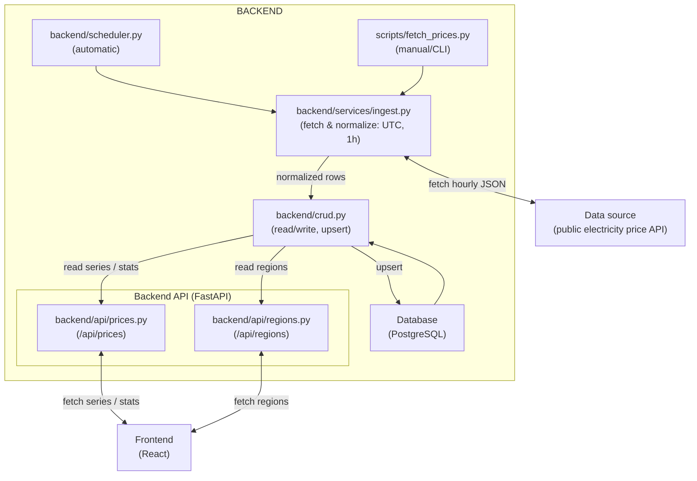

# Nordic-Energy-Dashboard

A small, holistic project: fetches hourly electricity prices from a public source, stores them locally, and exposes them via an API which the frontend displays in a simple dashboard.

## Quick start (development)

**Prerequisites**z
- Python 3.11+
- Docker Desktop (for local PostgreSQL)
- `config.yaml` at the repo root (use `default` or set `APP_ENV=dev`)

### 1) Start PostgreSQL (Docker)
```bash
docker compose up -d
```

### 2) Install Python dependencies
```bash
pip install -r requirements.txt
```

### 3) Initialize database tables (one-time)
```bash
python -m backend.init_db
```

### 4) Run the API (FastAPI)
```bash
uvicorn backend.main:app --reload
```
- Swagger UI: http://127.0.0.1:8000/docs


## Directory Structure

```
/                         # Repository root (README, license, CI, etc.)
├─ backend/               # Backend API, data models, and database access
│  ├─ api/                # FastAPI routers/endpoints (e.g. /prices, /regions)
│  │  ├─ prices.py        # Endpoints for price data
│  │  └─ regions.py       # Endpoints for region data
│  ├─ services/           # Ingest/normalization logic and scheduler helpers
│  │  └─ ingest.py        # Functions to fetch and normalize data
│  ├─ tests/              # Backend tests
│  ├─ models.py           # ORM models (database tables/entities)
│  ├─ crud.py             # CRUD operations (Create/Read/Update/Delete) for DB
│  ├─ db.py               # Database connection and session management
│  ├─ scheduler.py        # APScheduler setup (for scheduled jobs)
│  ├─ init_db.py          # One-time script to initialize local DB tables
│  └─ main.py             # FastAPI app entry point, CORS, routing, lifespan
│
├─ frontend/              # Client/dashboard (React/Vite etc.)
│
├─ scripts/               # Helper scripts for data fetching/loading
│  └─ fetch_prices.py     # Ingest script: fetches prices for date/region and saves to DB
│
├─ docs/                  # Documentation, diagrams, decision records
│
├─ config.yaml            # Configuration (default + optional dev overlay)
├─ config.py              # Loads config.yaml
├─ docker-compose.yml     # Local Postgres setup (for development)
├─ requirements.txt       # Python dependencies
└─ README.md              # This file
```

## Purpose per folder (short and concrete)

- **/backend**  
  Backend application code: FastAPI app, data models (ORM), database access layer, CRUD, scheduler wiring.

- **/backend/api**  
  HTTP API layer (FastAPI routers). Defines the request/response contract and delegates to CRUD/services.

- **/backend/services**  
  Ingest and normalization logic used by the scheduler and manual scripts (fetch → normalize to UTC/1h → hand off to CRUD).

- **/frontend**  
  Client (e.g. React) which calls the backend and displays graphs/KPIs.  
  _Contribute here when_: building UI components, fetching data from the API, or improving visualization/interactions.

- **/scripts**  
  Helper/CLI scripts for manual or batch operations (e.g., running ingest outside the scheduler). 

- **/docs**  
  Project documentation: architecture notes, diagrams, and decision records (ADR).

- **Naming convention**: keep file and directory names lowercase (kebab_case/snake_case), and put tests in relevant folders (e.g. backend/tests if used).

---

## Data Flow (from source → dashboard)



### Step-by-step
1. **Orchestration (two entry points)**
  
    - Automatic: `backend/scheduler.py` runs on a cron schedule from `config.yaml` and calls `backend/services/ingest.py`.

    - Manual: `scripts/fetch_prices.py` can be run from the CLI and calls the same ingest functions.

2. **Ingest & normalization (backend/services/ingest.py)** fetches hourly prices from the public source. Raw data is normalized: timestamps are converted to UTC, each record is validated to a 1-hour interval (`te = ts + 1h`), and rows are sorted ascending.

3. **Storage (idempotent)** Ingest calls backend/crud.py, which upserts into PostgreSQL. Uniqueness is enforced on (region, start_ts_utc), so importing the same date multiple times does not create duplicates.

4. **API layer** FastAPI in `backend/main.py` exposes:

    - `GET /api/regions` (from `backend/api/regions.py`)

    - `GET /api/prices` (from `backend/api/prices.py`) — supports `hours` (last N hours) or `from` / `to` (time range), plus stats (avg/min/max/count) over a range.
    
    Endpoints read via `crud` from the database (time series and aggregates).

5. **Frontend** The React client fetches data from the API (selected region/time window), renders a line chart and KPI cards (average/min/max), and lets the user switch region/period.

- **Time & timezone handling**: Timestamps are treated consistently (UTC) in storage and response. Frontend may format for local display.

---

## Contribution Notes (per part)

**Add a new API endpoint:**
- Model/CRUD in `/backend/models.py` + `/backend/crud.py`
- Route in `/backend/api/...`
- Update README for major changes

**Extend frontend:**
- Create a new component in `/frontend/src/components`
- Fetch data via a small API helper (keep URLs together)
- Add simple loading/error handling in the UI

**New ingest or data source:**
- Create a new script in `/scripts` (preferably with a small --help)
- Reuse validation/normalization, and write idempotently to DB
- Briefly document in README what the script does

---

## Consistency and Clarity

- **Single responsibility per layer**: Ingest handles fetch/normalization; backend exposes data; frontend presents it.
- **Idempotent ingest**: running multiple times does not duplicate data.
- **Simple API contracts**: fixed parameters and types; sort time ascending.
- **Readability > magic**: short functions, clear names, and brief comments where it saves time for the next developer.